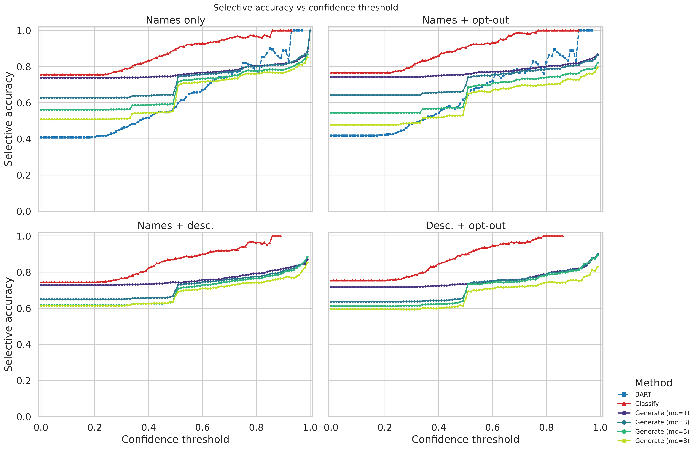
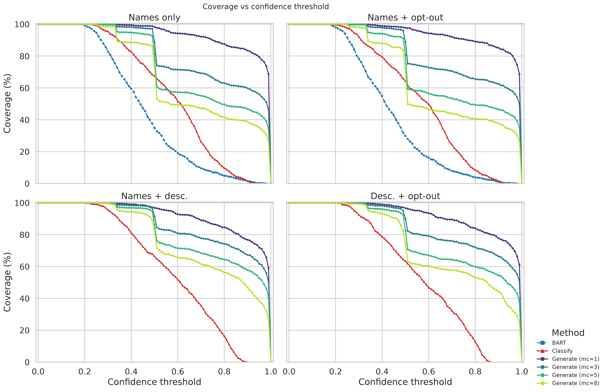

# Motivation

## The Problem

- **Text classification** is pervasive: sentiment analysis, product categorization, economic-taxonomy coding
- Traditional supervised pipelines demand labeled data, feature engineering, and retraining
- LLMs enable **zero-shot** classification via in-context learning

::: {.incremental}
- Proprietary cloud APIs incur **recurring costs**
- They require **internet connectivity**
- They expose **confidential or regulated data** to third parties
:::

## The Opportunity

Open-source LLMs (LLaMA, Mistral, Qwen, DeepSeek-R1) + lightweight serving (Ollama)
run on **consumer hardware**.

This creates an opportunity: classification tools that combine the zero-shot
reasoning of LLMs with the **privacy**, **cost-effectiveness**, and **offline
capability** of local inference.

## `ollama-classifier` — Three Principles

1. **No fine-tuning required.** Classification uses prompting and retrieval augmentation
2. **Local and private.** All inference runs on the user's hardware — no data leaves the machine
3. **Accompanied by calibrated uncertainty.** Every prediction carries a full probability distribution and a confidence score

# The Library

## Core API

Single backend-agnostic entry point: `LLMClassifier` over a backend such as `OllamaBackend`.

| Method | Description |
|--------|-------------|
| `classify()` | Multi-call completion scoring: one call per label, exact calibrated probabilities |
| `generate()` | Adaptive trie-masked generation: budget-controlled, may be approximate |
| `batch_classify()` / `batch_generate()` | Batch variants for many texts |

Each method has an **async** twin (`aclassify`, `agenerate`, …).

## Confidence Estimation — `classify`

For each candidate label $y_i$, the backend returns per-token log-probabilities of
that label's tokens $T_i$ given the prompt:

$$s(y_i)=\frac{1}{|T_i|}\sum_{t\in T_i}\log p(t\mid x,\text{prefix}_t)$$

$$\text{P}(y_i\mid x)=\frac{\exp(s(y_i))}{\sum_{j}\exp(s(y_j))}, \qquad \text{confidence}=\max_i \text{P}(y_i\mid x)$$

- **Geometric mean** of per-token log-probabilities → removes length bias
- **Max-subtracted softmax** → calibrated distribution
- Always exact, one call per label

## Confidence Estimation — `generate`

Candidate labels tokenized into a **prefix trie**; each constrained call
restricted to trie tokens while returning `top_logprobs` of every sibling.

- **Breadth-first search** over clusters of labels sharing a scored prefix
- Spends between 1 and `max_calls` calls
- Labels not emitted are still scored via sibling alternatives
- `coverage` = fraction of label's tokens scored; `approximate = True` when coverage < 1
- `max_calls=1` → single fast approximate call; `max_calls=None` → exact (worst case: one call per label)

## Backend Differentiation

All four backends expose per-token log-probabilities and support both strategies.

| Backend | Constrained-output mechanism | `classify` scoring path |
|---------|------------------------------|------------------------|
| Ollama | JSON Schema enum | Forced constrained generation |
| vLLM | `structured_outputs.choice` | Echo / prefill |
| SGLang | regex alternation | Echo / prefill |
| llama.cpp | GBNF grammar | Forced constrained generation |

vLLM and SGLang score each label as an unconstrained continuation (echo/prefill);
Ollama and llama.cpp read the **pre-mask logits** (genuine distribution before constraint).

# Ecosystem

## Graphical User Interface

`ollama-classifier-gui` — a companion desktop app (Flet) with five tabs:

- **Settings** — backend, endpoint, model, connection test, API key, theme
- **Data Input** — CSV/Excel load, sheet selection, column mapping
- **Schema** — labels, Classify/Score method, output format, system-prompt override
- **Results** — live progress, Excel export
- **Info** — version and project links

API keys stored in OS native secure storage (Keychain, Credential Manager, libsecret).

Installs with `uvx ollama-classifier-gui` or `pip install ollama-classifier-gui`.

## Cross-Language Ports

**R: `rollama-classifier`** — full API port including four backends, both strategies,
batch twins, and `classification_result` object. Installs from GitHub:
`pak::pak("paluigi/rollama-classifier")`

**Rust: `ollama-classifier-rs`** — mirrors Python API (four backends, `classify`/`generate`,
`ClassificationResult` struct, sync/async/batch). Tracking Python v0.4.1.
Added with `ollama-classifier-rs = "0.4"` in `Cargo.toml`.

# Application: COICOP Product Classification

## The Task

**COICOP 2018** — international standard for household expenditure categorization:
four-level hierarchy, 294 fine-grained subclasses.

Challenges:

- High linguistic variability across retailers and countries
- Strong class imbalance
- Textual overlap between semantically similar subclasses
- Multilingual coverage needed

Relevant to **Consumer Price Index** compilation by National Statistical Institutes.

## Experimental Setup

- **Dataset:** 637 manually labeled products from COICOP Division 01.2 (Non-alcoholic beverages), 7 subclasses
- **Baselines:** BART-large-MNLI (NLI zero-shot), scikit-llm (`ZeroShotGPTClassifier`)
- **Model:** Qwen2.5 3B-Instruct served by Ollama (shared across generative methods)
- **Configurations:** names only, +opt-out, names+descriptions, descriptions+opt-out
- **24 variations** total (BART ×2, scikit-llm ×2, classify ×4, generate ×16)

# Results

## Accuracy — Benchmark (excerpt)

| Variation | Acc. (%) | F1 (macro) | Time (s) |
|-----------|----------|------------|----------|
| BART (names only) | 40.8 | 0.445 | 444 |
| BART (names + opt-out) | 39.4 | 0.454 | 496 |
| Ollama `classify` (names only) | **75.5** | **0.703** | 2965 |
| Ollama `classify` (names + opt-out) | 74.7 | 0.705 | 3283 |
| Ollama `classify` (names + desc.) | 74.4 | 0.712 | 3007 |
| Ollama `classify` (desc. + opt-out) | 71.3 | 0.709 | 3397 |
| scikit-llm (names only) | 73.5 | 0.667 | 176 |
| scikit-llm (names + opt-out) | 68.0 | 0.651 | 183 |

`classify` (names only) beats BART by **34.7 pp**; scikit-llm within 2 pp at ~17× the speed.

## Confidence and Calibration

{fig-align="center" width="85%"}

## Calibration — Key Finding

- **BART** well calibrated (ECE ≈ 0.03–0.06)
- **`classify`** is **underconfident**: mean confidence 0.59 vs accuracy 0.76; reliability curve above diagonal
- **`generate`** is **overconfident**: mean confidence 0.94 vs accuracy 0.74; curve below diagonal
- Both generative strategies have high ECE (0.15–0.22) — absolute probabilities unreliable
- **But** ranking quality is strong: ROC-AUC of confidence 0.70 (BART) vs 0.79–0.83 (`classify`)

→ Practical deployment: prefer **ranking-based triage** or post-hoc calibration (sharpen `classify`, soften `generate`)

## Confidence Discrimination — Boxplots

{fig-align="center" width="90%"}

Welch $t$-tests (correct > incorrect) highly significant ($p < 0.001$) for all variations.

## Score-Gap Discrimination — Boxplots

{fig-align="center" width="90%"}

The score gap discriminates correctness comparably to confidence.

## Confidence & Calibration Metrics (excerpt)

| Variation | Conf. (corr.) | Conf. (inc.) | $r$ | ECE | AUC (conf.) | Brier |
|-----------|---------------|--------------|-----|-----|-------------|-------|
| BART (names only) | 0.532 | 0.414 | 0.347 | 0.055 | 0.697 | 0.215 |
| BART (names + opt-out) | 0.509 | 0.392 | 0.351 | 0.028 | 0.700 | 0.214 |
| `classify` (names only) | 0.632 | 0.442 | 0.488 | 0.170 | 0.820 | 0.171 |
| `classify` (names + opt-out) | 0.617 | 0.413 | 0.493 | 0.196 | 0.831 | 0.176 |
| `classify` (names + desc.) | 0.642 | 0.460 | 0.445 | 0.149 | 0.788 | 0.175 |
| `classify` (desc. + opt-out) | 0.627 | 0.425 | 0.484 | 0.177 | 0.821 | 0.174 |

All Welch $t$-tests significant ($p < 0.001$ after BH correction). `classify` has higher AUC but higher ECE than BART.

## Threshold-Based Discrimination

{fig-align="center" width="48%"}{fig-align="center" width="48%"}

Abstaining below the Youden-optimal margin lifts `classify` accuracy from 75.5% → 92.8% at 58.6% coverage.

## Threshold Discrimination Metrics

| Variation | AUC (conf.) | thr. | Sel. acc. (%) | Cov. (%) | AUC (gap) | thr. | Sel. acc. (%) | Cov. (%) |
|-----------|-------------|------|---------------|----------|-----------|------|---------------|----------|
| BART (names only) | 0.697 | 0.42 | 54.4 | 53.4 | 0.640 | 0.34 | 60.9 | 27.3 |
| BART (+ opt-out) | 0.700 | 0.41 | 56.3 | 51.8 | 0.644 | 0.27 | 59.5 | 33.3 |
| `classify` (names only) | 0.820 | 0.52 | 91.3 | 64.7 | 0.809 | 0.36 | 92.8 | 58.6 |
| `classify` (+ opt-out) | 0.831 | 0.53 | 92.4 | 59.3 | 0.817 | 0.34 | 93.0 | 60.0 |
| `classify` (+ desc.) | 0.788 | 0.54 | 89.0 | 61.2 | 0.799 | 0.30 | 89.0 | 65.6 |
| `classify` (desc. + opt-out) | 0.821 | 0.55 | 93.4 | 55.0 | 0.831 | 0.32 | 91.8 | 62.6 |

The score gap is as informative as confidence — sometimes more (desc. + opt-out: AUC 0.831 vs 0.821).

## Adaptive `generate` Strategy

{fig-align="center" width="85%"}

At `max_calls=1`, `generate` matches scikit-llm (73.8%); accuracy falls monotonically as budget grows.

# Discussion & Conclusion

## Design Decisions

1. **Local-first:** Ollama by default; vLLM, SGLang, llama.cpp for matching hardware
2. **No fine-tuning:** prompting + retrieval → maximum flexibility, no retraining
3. **Two scoring strategies** with explicit cost–accuracy trade-off:
   - `classify`: one call per label, exact probabilities
   - `generate`: budget-controlled, flags approximate results via coverage field

## Limitations

- Classification quality depends on underlying model (≥3B parameters recommended)
- LLM-based classification subject to **data-driven bias** — audit in sensitive settings
- Multi-call `classify` expensive for very large label sets → `generate` preferable
- Generative strategies **miscalibrated** (opposite directions) → use ranking-based triage or post-hoc calibration
- GUI is single-user desktop; multi-user server deployment left to future work

## Conclusion

- **`ollama-classifier`**: open-source Python library for zero-shot classification with locally-hosted LLMs
- Two confidence-bearing strategies across **four inference backends**
- Desktop GUI + cross-language ports (R, Rust)
- Compact 3B model **substantially outperforms BART** NLI baseline and **matches scikit-llm**
- Confidence scores and score gaps **reliably discriminate** correct from incorrect predictions
- Support effective **threshold-based triage** (75.5% → 92.8% at 58.6% coverage)

**Future work:** temperature scaling, conformal prediction, broader RAG pipeline, collaborative web interface

## Thank You

**Links:**

- `ollama-classifier`: `pip install ollama-classifier`
- `ollama-classifier-gui`: `uvx ollama-classifier-gui`
- `rollama-classifier`: `pak::pak("paluigi/rollama-classifier")`
- `ollama-classifier-rs`: `ollama-classifier-rs = "0.4"`

**Contact:** Luigi Palumbo (Bank of Italy) · Mengting Yu (Università degli Studi della Tuscia)
